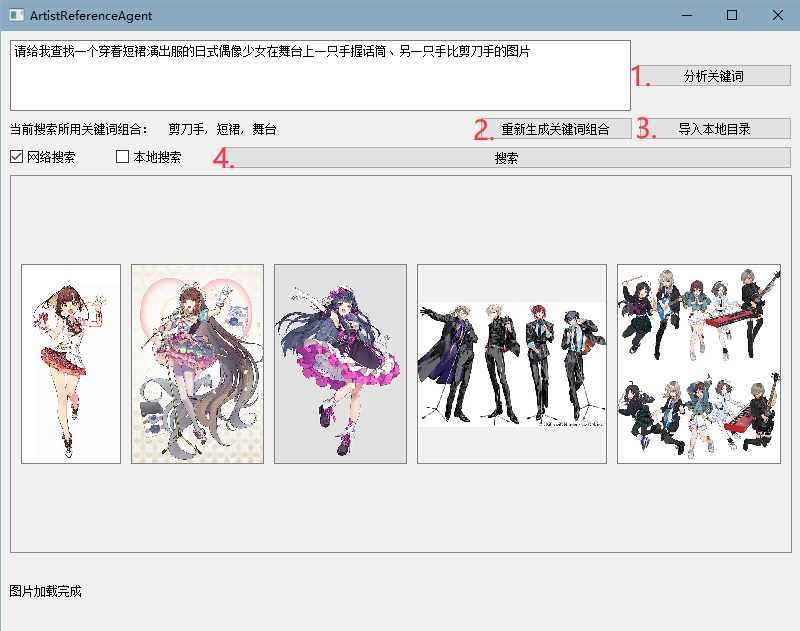
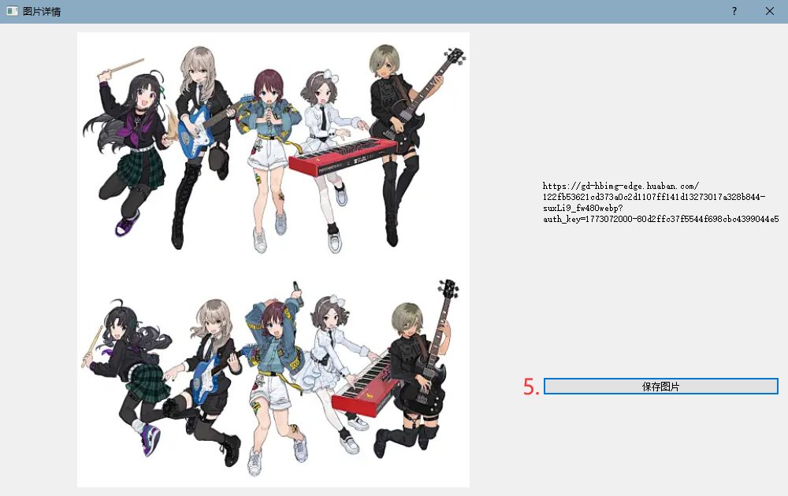

# ArtistReferenceAgent
一个集成式的图片素材搜索工具，用户可以输入文本需求，由llm分析需求关键词，在线上网站中搜索出最接近的图片素材，并返回素材的链接以供下载。

# 1. 功能介绍
### 1.1 关键词提取功能
* 支持两种模式：__jieba分词__ 和 __LLM提取__
* jieba分词模式：纯中文分词，速度较快，允许自定义关键词字典
* LLM提取模式：允许中英文输入，速度较慢，但可以联想出参考素材的隐含属性

### 1.2 关键词翻译功能
* 基于pygtrans的关键词翻译功能（需联网）：将中文关键词翻译为英文，便于在英文网站中搜索

### 1.3 图片搜索功能
* 支持多种图片素材网站：Pixabay、Unsplash、Pexels、花瓣网（原则上花瓣网禁止爬虫类操作，请勿使用。本项目仅作学习使用，无不良用途。）
* 搜索原理：
  1. 基于网站api构造请求，解析响应获取图片url。因此这类站点需要用户在`Config.json`中手动配置网站api与url
  2. 使用selenium模仿人类在浏览器中的搜索行为，直接解析网站响应得到的html中的图像元素。因此这类站点需要用户在`Config.json`中手动配置网站搜索页面url

### 1.4 图片显示功能
* 在页面中以网格形式显示搜索结果
* 点击图片可进入详情页，允许通过缩放窗口来缩放图片
* 在图片详情页中可以保存图片

### 1.5 缓存管理功能
* **CacheManager**：智能缓存管理器，支持 LRU（最近最少使用）缓存策略
* **缓存容量控制**：默认缓存 100 张图片，超出容量时自动移除最久未使用的图片
* **并发下载**：支持多线程并发下载图片，默认最大 5 个并发线程
* **双重缓存模式**：同时支持 URL 图片和本地路径图片的缓存
* **超时控制**：图片下载超时保护，默认 10 秒超时

### 1.6 本地向量数据库功能
* **ChromaDB 集成**：使用 ChromaDB 作为向量数据库，存储和管理图片特征向量
* **持久化存储**：支持数据库持久化，数据保存在 `./cache/LocalDB_dir` 目录
* **CLIP 模型特征提取**：利用 CLIP 模型提取图片和文本的特征向量，计算余弦相似度
* **批量处理**：支持批量导入本地图片文件夹，自动提取特征并存入数据库
* **向量搜索**：根据查询文本的特征向量，在数据库中搜索最相似的图片

### 1.7 本地搜索模式
* **双模式支持**：支持"网络搜索"和"本地搜索"两种模式
* **本地搜索原理**：
  1. 使用 CLIP 模型将用户输入的查询文本转换为特征向量
  2. 在本地向量数据库中检索最相似的 top_k 个图片
  3. 返回相似度得分排序的图片列表
* **离线可用**：本地搜索模式无需联网，完全依赖已导入的图片数据库

### 1.8 测试工具
* **独立测试脚本**：提供 `test_save_local_image_folder_to_local_db.py` 等测试文件
* **功能验证**：可单独测试 VisualEvaluator、LocalDB 等核心组件
* **调试友好**：支持在无 UI 环境下快速验证功能

# 2. 使用说明
程序运行界面如图所示：



1. 在文本输入框中输入图片需求描述，例如“*请给我查找一个穿着短裙演出服的日式偶像少女在舞台上一只手握话筒、另一只手比剪刀手的图片*”
2. 按钮1-【分析关键词】：将输入的文本进行关键词提取，并显示在关键词列表中
3. ~~（待实现）点击“翻译关键词”按钮，将关键词列表中的关键词进行翻译，并显示在关键词列表中~~
4. 按钮2-【重新生成关键词组合】：如果对提取得到的关键词组合不满意，可以点击“重新生成关键词组合”按钮。
   * 由文本提取得到的关键词是一个“大类-小类”的字典形式，而每次显示的关键词组合是其中某几个大类中数个小类的随机组合
   * ！注意：jieba分词模式下提取的关键词是固定的，此时重新生成只是随机组合数个关键词
   * LLM提取模式下，当缓存中的关键词组合被用完后，会重新调用LLM，重新生成的关键词可能与先前有所不同
5. 按钮 3-【导入本地目录】：选择本地图片文件夹，将其中的**所有**图片导入到向量数据库中（后台线程处理，不影响 UI 操作） 
6. 按钮 4-【搜索】：将关键词列表中的关键词进行搜索，并在界面下半显示搜索结果
   * **网络搜索模式**：在线搜索图片素材网站，获取图片 URL 并下载
   * **本地搜索模式**：在本地向量数据库中搜索相似图片，无需联网
7. 点击图片可以进入图片详情页
8. 按钮 5-【保存图片】：将图片保存到指定目录
9. **导入本地目录**：选择本地图片文件夹，将其中的图片导入到向量数据库中（后台线程处理，不影响 UI 操作）
10. 程序运行的详细配置请参阅 `Config.json` 文件

# 3. 运行方式
### 0. 版本说明
本项目基于`python>=3.9`开发，未测试更低版本的可用性
```bash
# 确认Python版本
python --version
# 创建虚拟环境
python -m venv ArtistReferenceAgent_env
# Windows激活
ArtistReferenceAgent_env\Scripts\activate
```
### 1. 安装依赖
```bash
pip install -r requirements.txt
```

### 2. 安装本地模型（可选）
1. llama_cpp.Llama类模型

请自行安装.gguf模型文件，保存与`model`文件夹下，并修改`Config.json`中的模型配置

2. ollama类模型

请自行安装[ollama](https://ollama.com)，在本地启动ollama服务，下载模型，并修改`Config.json`中的ollama配置。
* 在使用ollama安装的模型时请保持ollama后台运行

### 3. 运行程序
运行`main.py`即可启动程序。

# 4. 项目结构
```text
├── config/                         # 配置文件目录
│   ├── Config.json                 # 主配置文件
│   └── feature_tags.json           # 特征标签配置文件
├── lib/                            # 核心代码库
│   ├── Controller.py               # 控制器，协调各模块工作
│   ├── ImageSearchClass.py         # 图片搜索实现类
│   ├── KeywordExtractor.py         # 关键词提取器
│   ├── QueryGenerator.py           # 查询语句生成器
│   ├── TagTranslator.py            # 标签翻译器
│   ├── VisualEvaluator.py          # 图片相似度得分评估器，使用 CLIP 模型提取【文本特征】和【图片特征】，计算其余弦相似度得分
│   ├── CacheManager.py             # 缓存管理器，缓存图片搜索结果，以 “图片url或本地路径” 为键，PIL.Image为值，支持 LRU 策略和多线程并发下载
│   ├── LocalDB.py                  # 本地向量数据库，基于 ChromaDB，管理图片特征向量
│   ├── LocalImageLoader.py         # 本地图片加载器，扫描文件夹并提取特征向量
│   ├── ResourceManager.py          # 资源管理器，提前下载模型文件资源
│   ├── NetworkProxyDetection.py    # 网络代理检测
│   ├── UI.py                       # 图形界面实现，包含导入本地目录的后台工作线程
│   └── dto/                        # 数据传输对象
│       ├── SearchResultDTO.py          # 图片搜索结果数据传输对象，包含了搜索得到的图片 url 列表
│       └── ImageInfoDTO.py             # 图片详情数据传输对象，包含了图片 url、图片标签等信息
├── cache/                          # 缓存文件目录
│   └── LocalDB_dir/                # 本地向量数据库存储目录
├── model/                          # 本地模型文件目录
├── test_save_local_image_folder_to_local_db.py  # 本地图片导入测试脚本
├── requirements.txt                # 项目依赖文件
└── main.py                         # 程序入口文件
```

# 5. 配置文件
配置文件位于`config`目录下：
1. `feature_tags.json`：特征标签配置文件，便于用户手动添加偏好的图像分类信息
2. `Config.json`：主配置文件，具体字段如下：

### UI配置(ui_config)
* **windowstart_x**: 程序启动时窗口左上角距离屏幕左边的距离(像素)
* **windowstart_y**: 程序启动时窗口左上角距离屏幕上边的距离(像素)
* **windowsize_width**: 程序窗口默认宽度(像素)
* **windowsize_height**: 程序窗口默认高度(像素)
* **image_grid_column**: 图片搜索结果显示的网格列数

### 路径配置
* **default_save_picture_path**: 图片默认保存路径
* **translation_cache_path**: 翻译缓存文件存储路径
* **jieba_dictionary_cache_path**: jieba分词自定义词典缓存路径
* **jieba_running_cache_path**: jieba分词运行时缓存路径

### 查询生成配置
* **single_query_generate_max**: 单次生成的最大查询组合数量
* **single_query_by_many_categories**: 单次查询涉及的最大分类数量
* **single_query_by_many_element_per_category**: 单个分类中最多选取的元素数量

### LLM模型配置(llm_sites)
* **llm_name**: 当前使用的LLM模型类型("local_model"表示本地模型)
* **local_llm_name**: 本地模型的具体名称
* **api_key**: 在线模型API密钥
* **api_url**: 在线模型API地址
* **model_path**: 本地模型文件路径

### 搜索配置 (search_sites)
* **enabled**: 是否启用该图片网站搜索功能
* **api_key**: 图片网站 API 密钥
* **max_results**: 单次搜索最大返回结果数
* **url**: 网站 API 或搜索页面 URL
* **refresh_token**: Pixiv 网站刷新令牌 (用于认证)
* **timeout**: 搜索超时时间 (秒)

### 其他配置
* **local_db_path**: 本地向量数据库存储路径（默认：`./cache/LocalDB_dir`）
* **similarity_threshold**: 图片相似度过滤阈值（默认：0.2）
* **top_k**: 本地搜索返回的最相似图片数量（默认：10）
